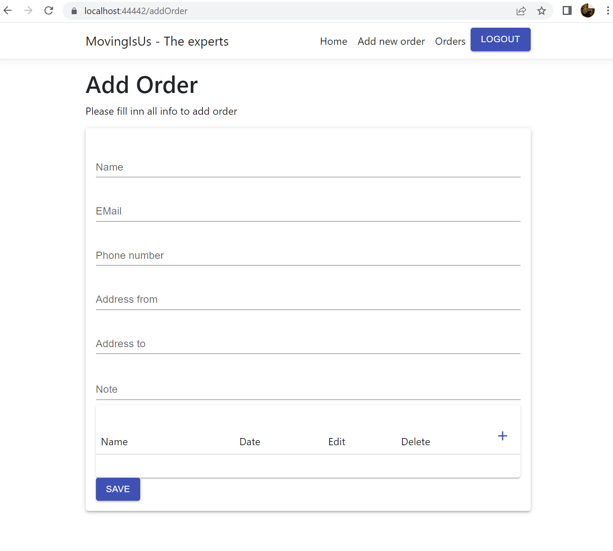
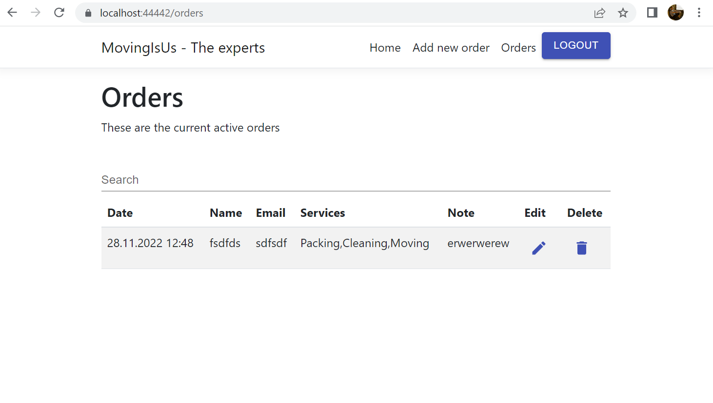
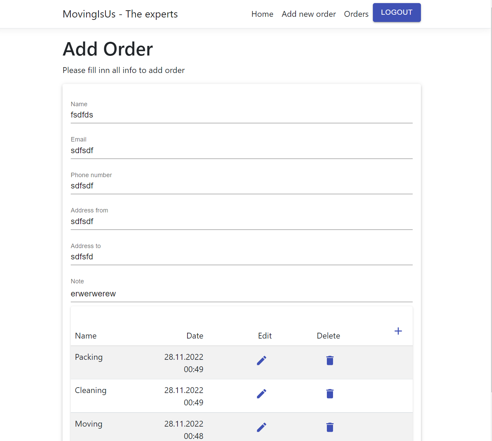
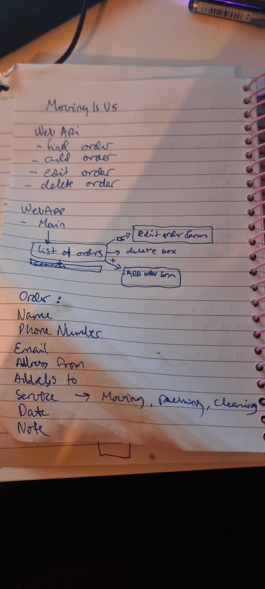
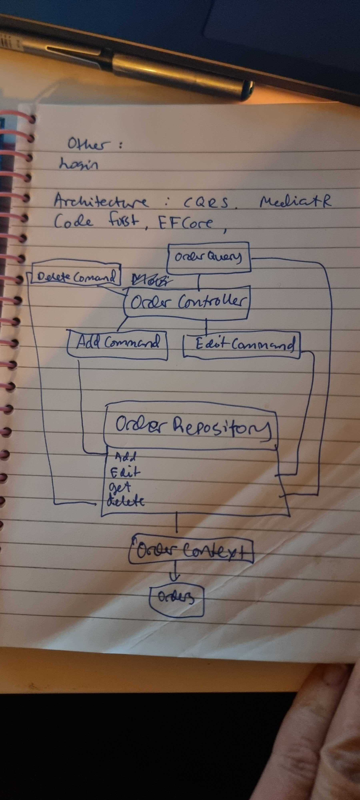

# movingIsUs
Description of assignment

Your solution should be extendable by request from the customer (The moving company) and should
be ready for production usage.
Create an application that a sales consultant working at a moving company will use to place / find /
edit / delete orders on behalf of customers.
The company that the sales consultant works at offers these services for their customers:
-Moving
-Packing
-Cleaning

When placing an order, the sales consultant will need the following information from the customer:
-Name
-Phone number
-Email
-Address he’s moving from
-Address he’s moving to
-What services they are ordering
-Dates for when the services are to be carried out
-A text field where the sales consultant can add a note to the order, for example: “the customer
won’t be available till 12 pm)

Create a web application that satisfies the following user stories.
User Stories:
-As a sales consultant, I want to place an order for a customer.
-As a sales consultant, I want to find an order that is previously placed for a customer.
(Search)
-As a sales consultant, I want to edit an order that I’ve previously placed for a
customer.
-As a sales consultant, I want to delete an order that I’ve previously placed for a
customer.

Exercise 1 – Service API
2) Write an API (Rest service) that satisfies the user stories and does the business logic. In exercise 2,
you will create a web application that will use the API.
Requirements: Any platform (Kotlin / Java - Spring boot or C# / .Net core - Web API)

Exercise 2 – Web
Write a web-application that satisfies the user stories. The web application will use the API built in
exercise 1.
Requirements: Vue, React or Angular preferred (Pure HTML / CSS / JS will be accepted. You can add
any other js library if needed). Use GULP/Webpack to run and pack the web application.

Exercise 3 – DevOps (Bonus if you have time)
Containerize your applications, Create automated build / deploy piplines (CI/CD) to an environment
(preferably a cloud environment) and deploy your containers.
Preferences: Azure DevOps / Github actions, Azure AKS / Azure App Service / Azure container service
(or similar on AWS / GCP).
It’s also ok to use any other provider and cloud platform if that is your preference.

##The Result
End result works. You can do all the things you want:
Place an order for a customer
 
 
 
Find an order that is previously placed for a customer.
(Search)
Delete an order that I’ve previously placed for a
customer.
 

 
Edit an order that I’ve previously placed for acustomer.
 
 
 

## The Process
### Initial stage
I started by reading the requirements, writing them down in my understanding and thinking how to approach it.
Next step was to draw some basic sketches on paper and go over some ideas for how it could look.
 
 
 
### Technology
Next was to think about how to approach it technically and what I wanted to do with architecture.
I am most familiar with .NET, although it has been a year an a half since I did anything with it. Therefore I went for a .NET backend. 
My next thought was that it should be flexible and possible to extend at some point, so I went for a CQRS approach with MediatR.
For the database I chose SQL server, with EF Core and Code first.
For authentication I chose OpenIddict, mostly because it was quick and easy to drop in.
For front end I chose React, mostly because of my experience with it before.
So, when technology was selected, I made a simple sketch of how it could look. Even if I went with CQRS setup of the handling of the requests, I still went for a repository approach to getting data. This way, I reduce the amount of copied code in the commands and queris. I don't like repeating myself too much.
 
 
 

### Planning
The next step was to make some tasks for the work to structure it:
Task 1 -> Set up general architecture on backend
Task 2 -> Add authentication and authorization
Task 3 -> Set up logging on backend
Task 4 -> Start webapp with login and set up the rest of the REST API
Task 5 -> Add Screen for seeing orders
Task 6 -> Add screen for editing orders
Task 7 -> Add operation for deleting orders
Task 8 -> Add search to order list
Task 9 -> Documentation

### Things I wish I had time for:
- Input validation
- DevOps and build
- Even more structuring of the frontend
- Testing

